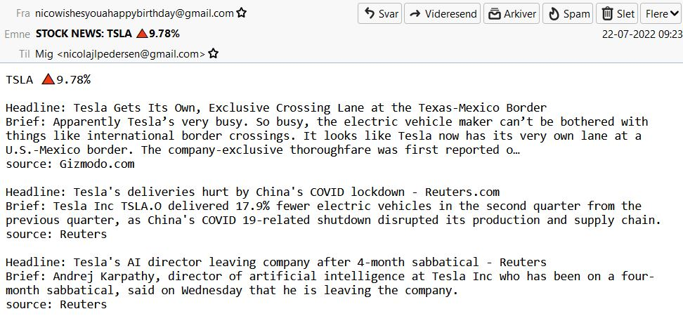

# STOCK NEWS ALERT
A stock app which calculates the negative or positive percentage of the closing prices ranging from yesterday to the day before that. If the price dropped or increased by 5% it'll send you a mail with the percentage and the 3 latest news articles.
